# Wortag

A native macOS desktop widget for a little German, every day. Built with SwiftUI,
WidgetKit and App Intents. Requires macOS 14 or newer.

Version **1.1.0** adds offline dictionary details, pronunciation, graded recall,
optional daily notifications and practice statistics.

## Screenshots

Rendered from the native app and widget views using sample learning data.
Desktop widget appearance can vary with macOS appearance settings.

### Desktop widget

| Small · one example | Medium · two examples | Large · three examples |
| :---: | :---: | :---: |
| 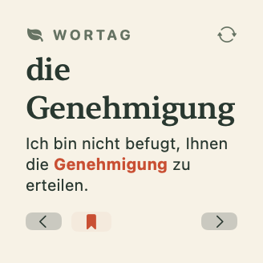 | 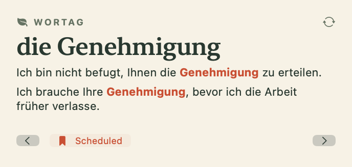 | 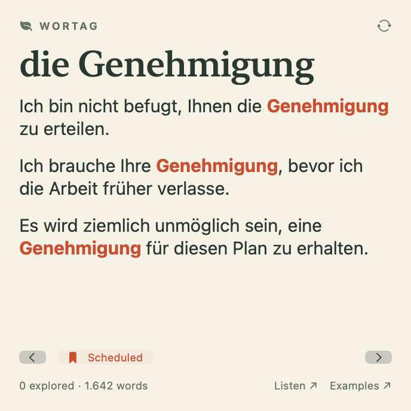 |

Practice mode hides the answer until you reveal it, then offers four recall grades.

| Small · revealed answer | Medium · revealed answer | Large · meaning clue |
| :---: | :---: | :---: |
| 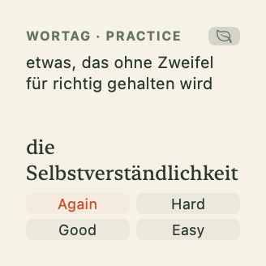 | 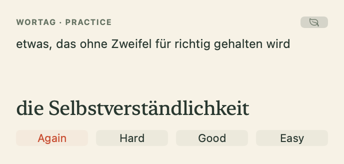 | 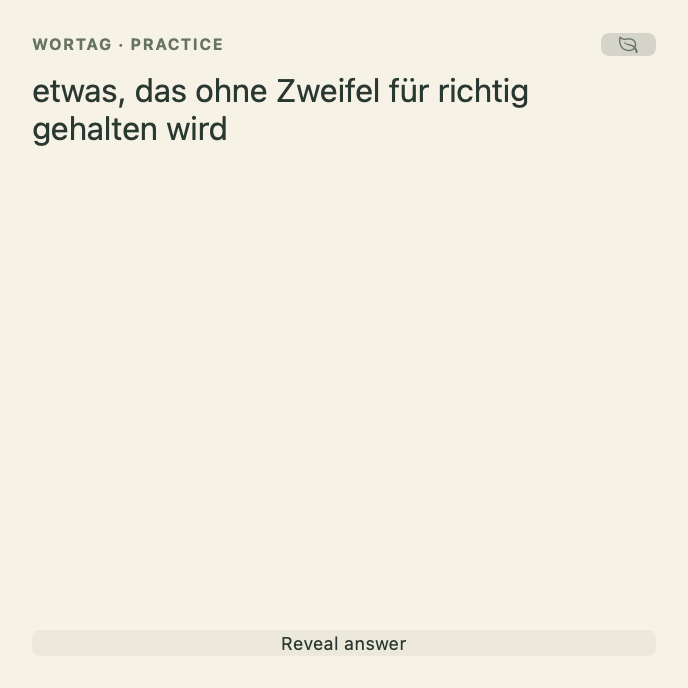 |

### Companion app

**Today** — the current word, dictionary forms, pronunciation and varied examples.

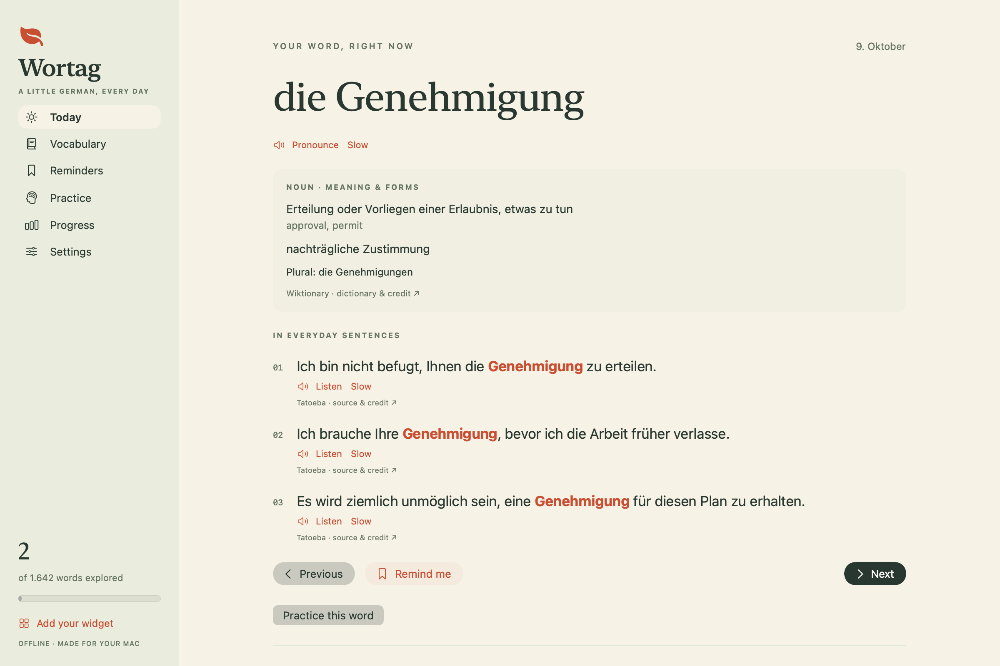

**Practice** — recall a word from its German definition, reveal and grade it.

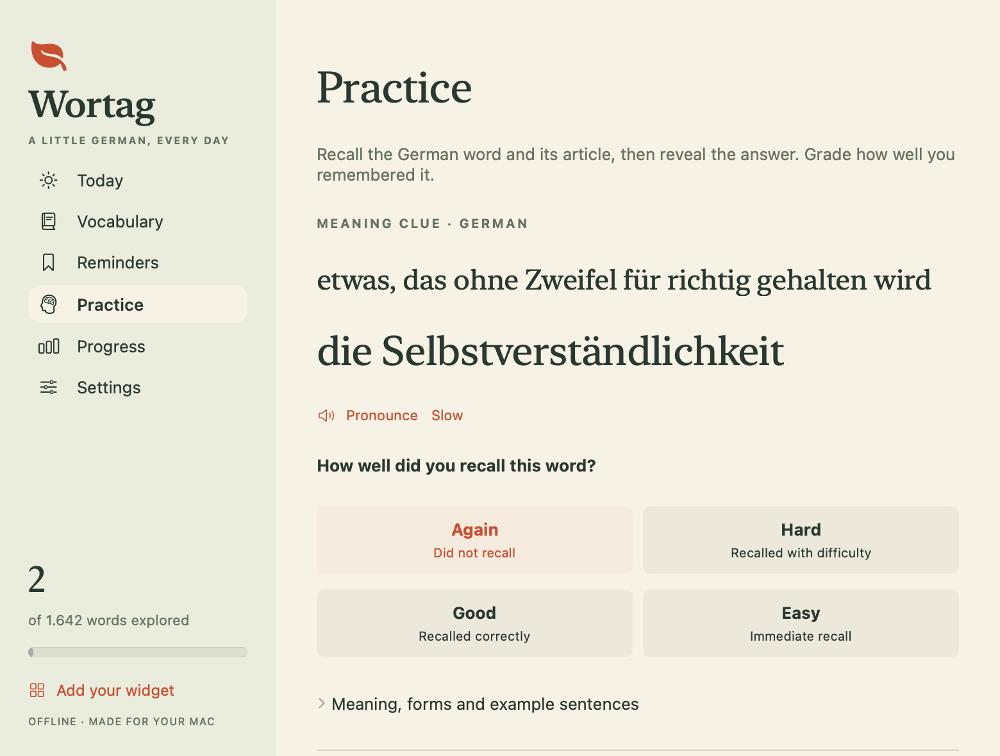

<details>
<summary>Vocabulary, Reminders, Progress and Settings</summary>

**Vocabulary** — browse and search the offline word library.

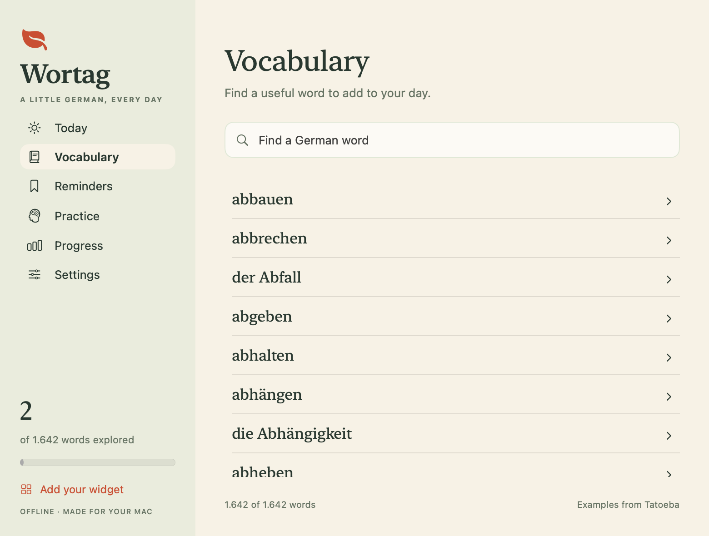

**Reminders** — saved words and their upcoming review intervals.

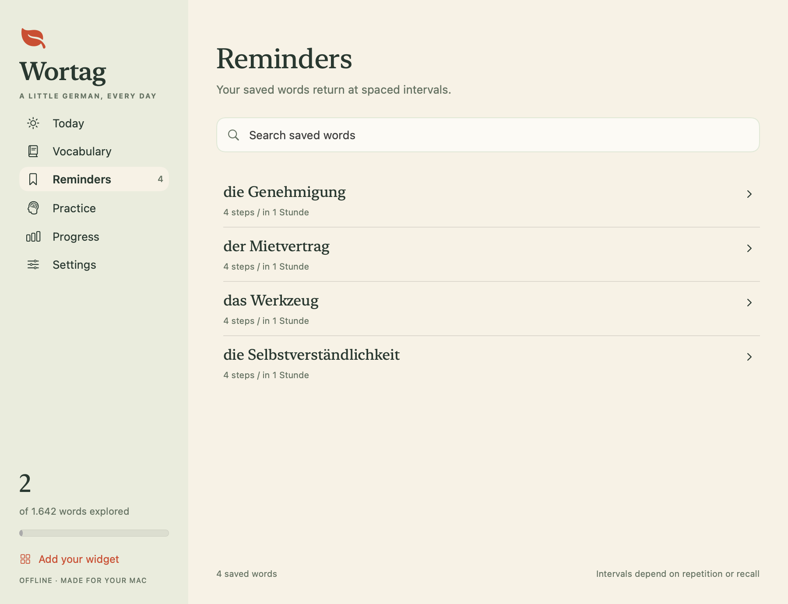

**Progress** — graded reviews, self-rated recall, daily goals and a seven-day chart.

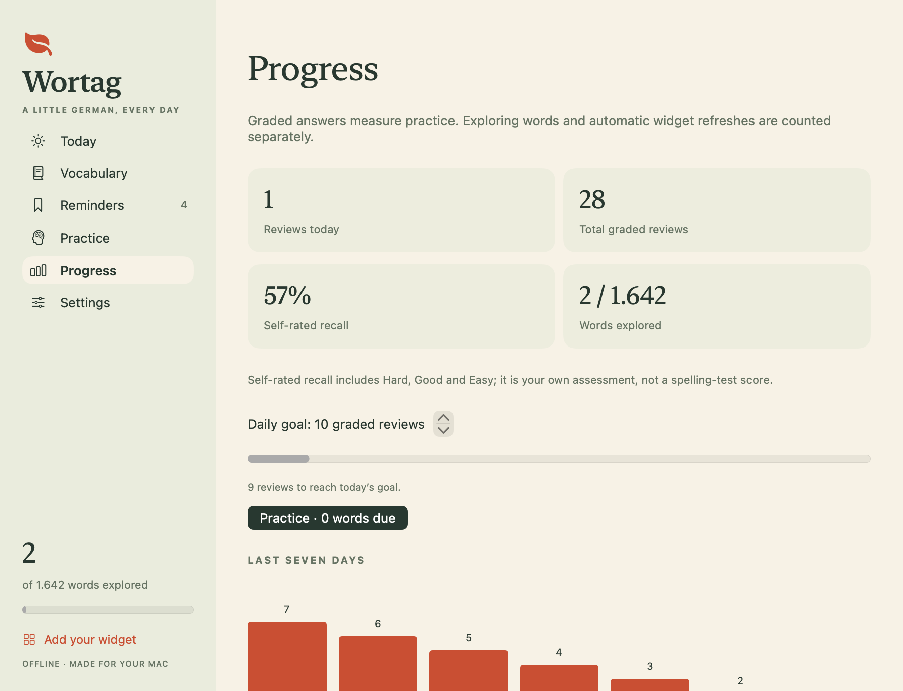

**Settings** — optional daily notifications at your chosen local time and weekdays.

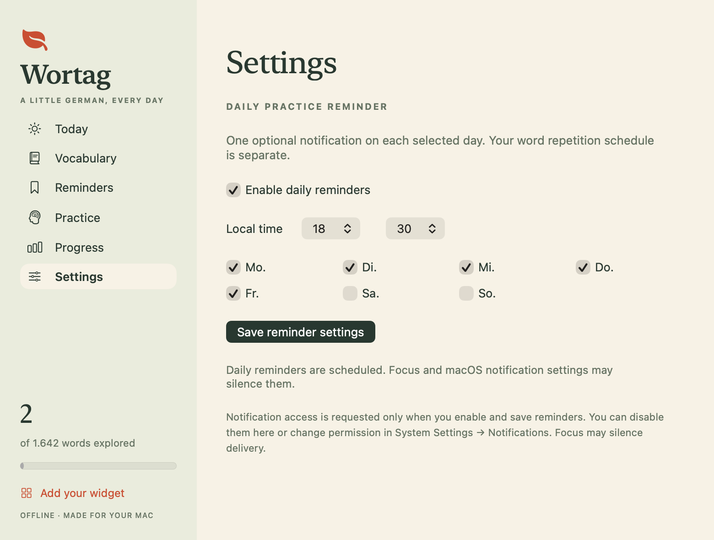

</details>

## Start using it

Wortag currently ships as source code, not a downloadable installer. A fresh
clone does **not** contain `build/Wortag.app`; you must build it on your Mac first.

### 1. Prepare your Mac

- Use **macOS 14 or newer**.
- Install the **full Xcode app, version 15 or newer**, using a version compatible
  with your macOS. The standalone Command Line Tools are not sufficient.
  Open Xcode once and finish its first-launch setup. In **Xcode → Settings →
  Locations → Command Line Tools**, select the installed Xcode version.
- Install [Homebrew](https://docs.brew.sh/Installation) if you do not already
  have it, then install [XcodeGen](https://formulae.brew.sh/formula/xcodegen):

  ```sh
  brew install xcodegen
  ```

No paid Apple Developer membership, API key or vocabulary download is required.
The vocabulary is already bundled in the repository.

### 2. Download, build and launch

Run these commands in Terminal from a folder where you want to keep the project:

```sh
git clone https://github.com/berkethetechnerd/wortag-widget.git
cd wortag-widget
bash Scripts/build.sh
bash Scripts/run.sh
```

Wait for `build.sh` to finish with **BUILD SUCCEEDED** and a `Built: …/Wortag.app`
message. `run.sh` then opens the app. The scripts build, locally sign and register
both the app and its widget extension. Keep the project folder and
`build/Wortag.app` in place while using the widget; the app is installed at that
location, rather than copied into Applications.

If you already cloned the project, start from `cd` into your existing checkout
instead of cloning it again. If building fails, resolve the Terminal error before
trying to add the widget. An error mentioning an active developer directory at
`/Library/Developer/CommandLineTools` means you need to select the full Xcode
installation as described above.

### 3. Add the desktop widget

After the app has opened, right-click an empty area of your desktop → **Edit
Widgets** → search **Wortag** → add a widget. See Apple's
[desktop widget instructions](https://support.apple.com/guide/mac-help/add-and-customize-widgets-mchl52be5da5/mac).
You can close the app window after setup; the widget's controls work independently.

Medium shows up to two German examples; large shows up to three German examples,
or two with English translations. Small shows one compact example.
If Wortag does not appear immediately, close and reopen the widget gallery. If it
still does not appear, run `bash Scripts/run.sh` again from the project folder,
then reopen the gallery. The app's **Add your widget** button also explains setup.

Each build is signed locally for the Mac where it is built. These instructions
are for building from source on your own Mac; the app bundle is not notarized for
distribution to other Macs. The local build uses a dedicated progress folder
shared by its two sandboxed components. It does not request access to other apps'
data.

## Discovery and word reminders

- **Previous** replays the actual card history. **Next** moves forward through
  that history before selecting a new card. Command–Option–Left/Right also work in the app; plain arrow keys remain available for editing searches.
- New cards come from a shuffled bag. A new shuffle begins when the bag is used
  up, so learning continues indefinitely. Unmarked words are not repeated within
  one pass, and immediate repeats are avoided when another word remains in the bag.
- **Remind me** / the bookmark button schedules the displayed word within four
  learning steps or one hour, whichever makes it due first. Due words take priority
  over random discovery. Repeated clicks do not add duplicates or postpone it.
- Reviews then recur after 12, 36, 108, 324 and 972 learning steps, or 1, 3, 7, 21 and
  60 days. The final interval repeats. Clicking Remind me again brings a word
  back to the first interval. These discovery reminders provide repeated exposure.
  A learning step is a new discovery card or a graded Practice answer; replaying
  history does not advance the counter.
- If several words become due together, they appear over successive Next
  actions. A one-word or fully marked deck remains usable even if early repeats
  are necessary.
- The widget requests automatic rotation about once an hour. macOS decides the
  actual refresh time; manual buttons update immediately through App Intents.
  You can disable automatic rotation in the app. Browsing history resets the
  hourly refresh timer and does not advance the review counter.
- Clicking the word or background refreshes the card in place. Previous, Next
  and Remind me also work without opening the app. The Examples link opens its
  source website; the explicit Open Wortag link is available if loading fails.
  **Listen ↗** in the large widget opens the app and pronounces the displayed word.

All instances use the same current card and schedule. History keeps the latest
5,000 cards; the explored-word count persists. The companion app includes a
searchable vocabulary, reminder management and optional English translations.
Noun headings include their definite article: **die Genehmigung**, **der Mietvertrag**,
**das Werkzeug**. Articles also appear in vocabulary and reminder lists. Verbs
use their infinitive dictionary form.

## Meaning, forms and pronunciation

Each active word includes up to three German dictionary definitions, with
English glosses matched to their sense where the source provides them. Nouns
show nominative plurals. Verbs show recorded present (er/sie/es), past (ich),
participle and perfect auxiliary forms. Selected verbs also have reviewed
preposition/case notes, such as **verzichten auf + Akkusativ**. Missing source
forms are left unfilled; dictionary coverage does not imply every possible
meaning or construction is listed. The Wiktionary link opens the full entry.

Use **Pronounce / Listen**, **Slow** or **Stop pronunciation** beside a word or
sentence in the app. Playback uses an installed German macOS voice and requests
no microphone access. If none is available, Wortag explains how to add one in
System Settings → Accessibility → Spoken Content / Read & Speak. The widget
delegates audio to the app through its explicit Listen link.

## Practice and graded recall

Open **Practice**, or choose **Practice this word** from Today or a library
detail. A German definition is the clue; the headword is masked if it occurs
inside the definition. Think of the word and its noun article, choose **Reveal
answer**, then rate your recall:

| Grade | Effect |
| --- | --- |
| Again | Restarts the interval; returns after one more learning step or ten minutes. |
| Hard | Steps back one interval, with a minimum of four steps or one hour. |
| Good | Moves forward one interval. On a new word, Good schedules 12 steps or one day. |
| Easy | Moves forward two intervals. On a new word, Easy schedules 36 steps or three days. |

The common interval ladder is 4, 12, 36, 108, 324 and 972 learning steps, or
1 hour, 1 day, 3 days, 7 days, 21 days and 60 days; the earlier threshold wins.
The last interval repeats. Previously scheduled words start from their saved
interval. Due words come first, then new practice words in
random order. Grading immediately prepares the next question. Opening and
revealing do not count as reviews. Once a word has a graded schedule, discovery
browsing can still display it but only another grade advances its interval.

Practice and discovery keep separate current cards. All app windows and widget
instances share the same practice question. Stale or duplicate grade actions
cannot record a second review. **Use Practice mode in the widget** switches all
widget sizes to the same reveal/grade flow. The leaf button returns to discovery
without opening the app. Practice refreshes retain an unanswered question and
do not advance hidden discovery words. An empty Practice widget requests its
next refresh at the earliest time-based review; macOS controls delivery. With
automatic refresh disabled, use **Check for words** instead.
If every word has a future review, Practice waits until
one is due; you can still browse indefinitely or practice a specific library word.

## Daily notifications and progress

In **Settings**, enable daily reminders, choose a local hour/minute and one or
more weekdays, then save. Notifications are off by default. macOS permission is
requested only when you enable and save them; a refusal leaves reminders off.
Changing the time or weekdays replaces the schedule. Disable and save to cancel
it. Clicking a notification opens Practice. Notification delivery follows macOS
and Focus settings, so it is not guaranteed at an exact instant. These daily
practice prompts are separate from individual word repetition schedules.

**Progress** shows today's and lifetime graded reviews, self-rated recall,
explored words, a seven-day activity chart and up to five words with the most
Again/Hard ratings in the last 100 answers. Hard, Good and Easy count as recalled;
this reflects your assessment, not an automatically checked answer. Set a daily
goal from 1 to 100 reviews and practice due or difficult words directly. Days use
your local time zone. Existing explored words are preserved and do not create
historical recall scores. The latest 5,000 answer events are retained, while
daily totals preserve lifetime counts.

To start over, choose **Settings → Reset progress…** and confirm. This clears
explored words, browsing history, practice ratings and statistics, all word
review schedules, daily notifications and the old schema 1 progress backup.
Learning settings return to their defaults, with daily reminders off. The app
and widgets show a fresh starting word with zero explored words. The vocabulary
is retained. Cancel leaves progress untouched; a reset cannot be undone.

## Offline data and privacy

The active deck contains **1,642 practical noun and verb lemmas**, targeting mostly
**B1–C2**. This is an editorial difficulty estimate, not a certified CEFR label
for every word. A reviewed allowlist (`Scripts/practical_words.txt`) selects
objects, useful processes and actions for home, work and public life. A recorded
German Wiktionary subset validates the part of speech and dictionary form.
Beginner targets such as Wohnung, conjugation/plural duplicates, personal names,
countries and nationalities are excluded. Each active card keeps two or three
varied examples and English translations where available.

The original 10,000 card identities remain bundled as an archive. Excluded
cards leave the library, shuffled bag, automatic reviews and Previous/Next
navigation. Their history, explored IDs and reminder records remain saved,
so changing the deck does not erase progress. The displayed explored count
includes only active words; reminders for retained words keep their schedules.
The smaller active deck continues reshuffling indefinitely.

Examples come from the ManyThings/Tatoeba corpus. It compares
German and English content stems after removing pronouns and function words,
rejecting grammatical rewrites. It searches the full sentence pool and never
fills a card with rejected near-duplicates. A larger Tatoeba export supplies
additional contexts; sixteen explicitly authored examples cover seven words.
Three legacy spellings use modern display forms while retaining their stable
card IDs. No API key, online account or
network request is needed at runtime. Clicking a source link opens its website.
See `DATA-LICENSES.md` for provenance and credits.

Learning progress lives in `~/Library/Application Support/Wortag/learning.json`.
Both targets remain sandboxed and receive read/write access only to that folder
through a home-relative file entitlement. The folder is accessible only to your
login user. The original App Group progress was preserved during the repair.
Writes are atomic and protected with a file lock across the app and extension.
Unreadable progress is preserved and reported instead of silently reset.

The first 1.1.0 launch upgrades progress to schema 2 and preserves the original
schema 1 bytes in `learning-v1-backup.json` in the same folder. Existing history,
explored IDs and reminder schedules survive the upgrade. Older Wortag builds
cannot read schema 2; keep the backup if you plan to return to an older version.
New practice results and preferences remain only in the current progress file.

## Build and test

Xcode 15+ and XcodeGen are required to rebuild. The generated Xcode project is
included, and `project.yml` is the editable project definition.

```sh
bash Scripts/build.sh
bash Scripts/run.sh
swift test
```

`build.sh` uses Xcode's native local signing, so sandbox entitlements are present
before the app or extension is registered with macOS. Both the intermediate
product and installed copy are signed; only `build/Wortag.app` is left registered.
It stops previous builds before replacing their executable signatures.
For a Developer ID/App Store release, configure a developer team and provision
an App Group in both targets instead of using this local folder entitlement.
Do not mix local and team-signed variants in one installation.

To rebuild the vocabulary (build time only):

```sh
python3 -m venv .data-venv
.data-venv/bin/pip install wordfreq==3.1.1 nltk==3.9.2
curl -fL https://www.manythings.org/anki/deu-eng.zip -o /tmp/wortag-deu-eng.zip
curl -fL https://downloads.tatoeba.org/exports/per_language/deu/deu_sentences_detailed.tsv.bz2 -o /tmp/wortag-deu-detailed.tsv.bz2
.data-venv/bin/python Scripts/build_vocabulary.py /tmp/wortag-deu-eng.zip Resources/vocabulary.json --supplement /tmp/wortag-deu-detailed.tsv.bz2
.data-venv/bin/python -m unittest discover -s Scripts -p 'test_*.py'
```

When updating the corpus, update its version, checksum and notices as well.
The builder preserves IDs from the existing JSON. It validates all example
pairs before replacing the output atomically, and fails if a card lacks at least
two distinct contexts. NLTK's stemmers require no additional model downloads.
Runtime has no third-party package dependencies.

The vocabulary builder automatically applies the checked-in noun dictionary
subset and practical lemma selection. To edit the active words, edit
`Scripts/practical_words.txt` and run `python3 Scripts/practical_vocabulary.py
Resources/vocabulary.json`. New entries also require a validated dictionary
record and varied corpus examples. To regenerate that subset from the source recorded in DATA-LICENSES.md:

```sh
curl -fL https://kaikki.org/dictionary/downloads/de/de-extract.jsonl.gz -o /tmp/wortag-de-wiktionary.jsonl.gz
python3 Scripts/noun_articles.py Resources/vocabulary.json --extract /tmp/wortag-de-wiktionary.jsonl.gz
```

Running `noun_articles.py Resources/vocabulary.json` without `--extract` applies
the saved subset without downloading anything. Enrichment preserves all card
IDs, order, original word forms and examples, so learning history stays valid.

Practical selection also applies `Scripts/learning_dictionary.json`, the saved
definitions and forms for all active IDs. To regenerate it from that same source:

```sh
python3 Scripts/learning_dictionary.py Resources/vocabulary.json --extract /tmp/wortag-de-wiktionary.jsonl.gz
```

Without `--extract`, the command reapplies the checked-in metadata offline. New
active IDs need a corresponding dictionary entry before selection can succeed.
The live Kaikki download changes over time; use the recorded source checksum
when reproducing this release and update credits when adopting a newer extract.

To check the widget layout with native SwiftUI rendering, without opening the
app or changing progress:

```sh
swiftc -parse-as-library -D WORTAG_RENDER Shared/*.swift Widget/*.swift Scripts/NativePreview.swift Scripts/render_widget.swift -o /tmp/wortag-render
/tmp/wortag-render "$PWD/build/Wortag.app" /tmp/wortag-previews
```

This produces 36 PNG previews at the small, medium and large widget sizes,
including long nouns, translations, alternate foreground appearances, asymmetric
margins, load errors, hidden/revealed Practice states and 1×/2× rendering. The
production card view is shared with the renderer. The reading area and empty
spaces use separate refresh buttons rather than an overlapping background button.

The Reminders page uses a fixed top heading and a centered empty state. Search
appears once words are saved, and a no-results search offers Clear search.
The empty state links directly to today's word. Content width is capped and
centered within the main pane, with consistent margins as the window resizes.
Vocabulary uses the same page layout; searches reset when switching sections.

To render app layouts with native macOS controls and fixture data (no progress
reads or writes), including empty, saved, search and detail states:

```sh
swiftc -parse-as-library -D WORTAG_RENDER_APP Shared/*.swift Shared/Presentation/*.swift App/*.swift Scripts/NativePreview.swift Scripts/render_app.swift -o /tmp/wortag-render-app
/tmp/wortag-render-app "$PWD/build/Wortag.app" /tmp/wortag-app-previews
```

The 18 app fixtures include compact and wide Practice, empty/populated Progress,
and disabled/enabled reminder settings. Preview services never speak, request
notification permission or schedule real notifications.

## Code structure and regression checks

`Shared/LearningState.swift` implements history, shuffled discovery and spaced
reviews without UI or file access. `ReviewSchedule.swift` owns the learning
intervals and review ordering. `LearningStore.swift` persists that state under
an interprocess lock and validates saved data before using it. `Vocabulary.swift`
loads and validates the offline deck, caching its active IDs.

The app model depends on `LearningRepository`, allowing recovery and write
failures to be tested with a substitute repository. Widget reloads are injected
by the app entry point. App views have separate responsibilities for navigation,
the sidebar, today's word, the library and setup. `WordDetailsView` shares the
article, examples, translation and attribution presentation between both pages;
`LibrarySection` shares filtering, search and schedule ordering with tests.
`Practice.swift` owns question tokens, grading policy and recall history.
`ProgressSummary` computes statistics independently of the UI. `ReminderModel`
depends on `ReminderScheduling`; the macOS adapter owns permission checks,
calendar triggers and notification routing. The app owns its speech synthesizer.
Practice, Progress and Settings each have a dedicated view. The notification
route retains its request until a window can consume it and reopens the main
window through an injected action.

The widget uses the same learning domain, store and highlighting helper, without
compiling app presentation code into the extension.

GitHub Actions runs the Swift and Python suites, builds and verifies both signed
targets, and uploads layout fixtures on macOS 15 Apple Silicon and Intel runners.
The renderers exercise production views without reading or writing progress.
Their previews supplement manual desktop-widget checks; they do not reproduce
WidgetKit's complete host, rendering transformations or refresh scheduling.
See [REVIEW-1.1.md](REVIEW-1.1.md) for this release's findings, coverage and
remaining limits; [REVIEW.md](REVIEW.md) records the earlier 1.0 review.
